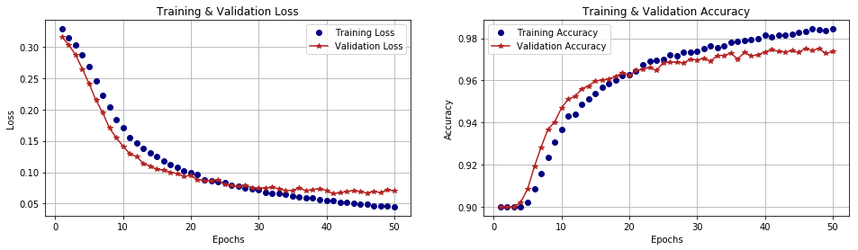

# Animal 10 Image Classification

Dibuat untuk memenuhi tugas bear matakuliah Machine Learning di Program Studi S1 Teknik Komputer Universitas Telkom

## Contributors

- [min4tozaki](https://github.com/min4tozaki) - Muhammad Rizqi Mubarak (1103161076)
- [yusrilfirza](https://github.com/yusrilfirza) - Yusril Firza (1103160106)
- Muhammad Wahyu Putra Indi
- Muh. Rico Andreas
- Yusuf Azzam
- Abdul Manan 

## Method

KNN (K-Nearest Neighbors)

## Dataset

- [kaggle/alessiocorrado99/animals10](https://www.kaggle.com/alessiocorrado99/animals10)

## Tools

- [Python3](https://www.python.org/download/releases/3.0/)
- [Jupyter Notebook](https://jupyter.org/)
- [Google Colab](https://colab.research.google.com/)
- [Kaggle Kernel](https://www.kaggle.com/kernels)

## Python3 Requirements

- [tensorflow](https://www.tensorflow.org/)
- [keras](https://keras.io/)
- [numpy](https://numpy.org/)
- [panda](https://pandas.pydata.org/)
- [opencv-python](https://opencv.org/)
- [scikit-learn](https://scikit-learn.org/stable/)

## Tensorflow Models

For this model is highly recommended using GPU because the process is much faster then using CPU for process

Using GPU vs Using CPU

```py
GPU
40s - 60s per epoch

CPU
20m - 30m per epoch
```

### Sourcecode for tensorflow model

```py
base_model = applications.VGG16(weights='imagenet', include_top=False, input_shape=(img_rows, img_cols, img_channel))

add_model = Sequential()

# base_model.output_shape[1:] = 224, 224, 3
add_model.add(Flatten(input_shape=base_model.output_shape[1:]))
add_model.add(Dense(256, activation='relu'))
add_model.add(Dense(10, activation='softmax'))

model = Model(inputs=base_model.input, outputs=add_model(base_model.output))
model.compile(loss='binary_crossentropy', optimizer=optimizers.SGD(lr=1e-4, momentum=0.9),
              metrics=['accuracy'])

batch_size = 32
epochs = 50
```

### Output

```py
Model: "model"
_________________________________________________________________
Layer (type)                 Output Shape              Param #
=================================================================
input_1 (InputLayer)         (None, 224, 224, 3)       0
_________________________________________________________________
block1_conv1 (Conv2D)        (None, 224, 224, 64)      1792
_________________________________________________________________
block1_conv2 (Conv2D)        (None, 224, 224, 64)      36928
_________________________________________________________________
block1_pool (MaxPooling2D)   (None, 112, 112, 64)      0
_________________________________________________________________
block2_conv1 (Conv2D)        (None, 112, 112, 128)     73856
_________________________________________________________________
block2_conv2 (Conv2D)        (None, 112, 112, 128)     147584
_________________________________________________________________
block2_pool (MaxPooling2D)   (None, 56, 56, 128)       0
_________________________________________________________________
block3_conv1 (Conv2D)        (None, 56, 56, 256)       295168
_________________________________________________________________
block3_conv2 (Conv2D)        (None, 56, 56, 256)       590080
_________________________________________________________________
block3_conv3 (Conv2D)        (None, 56, 56, 256)       590080
_________________________________________________________________
block3_pool (MaxPooling2D)   (None, 28, 28, 256)       0
_________________________________________________________________
block4_conv1 (Conv2D)        (None, 28, 28, 512)       1180160
_________________________________________________________________
block4_conv2 (Conv2D)        (None, 28, 28, 512)       2359808
_________________________________________________________________
block4_conv3 (Conv2D)        (None, 28, 28, 512)       2359808
_________________________________________________________________
block4_pool (MaxPooling2D)   (None, 14, 14, 512)       0
_________________________________________________________________
block5_conv1 (Conv2D)        (None, 14, 14, 512)       2359808
_________________________________________________________________
block5_conv2 (Conv2D)        (None, 14, 14, 512)       2359808
_________________________________________________________________
block5_conv3 (Conv2D)        (None, 14, 14, 512)       2359808
_________________________________________________________________
block5_pool (MaxPooling2D)   (None, 7, 7, 512)         0
_________________________________________________________________
sequential_1 (Sequential)    (None, 10)                6425354
=================================================================
Total params: 21,140,042
Trainable params: 21,140,042
Non-trainable params: 0
_________________________________________________________________
```

## Training Input

```py
data train = 4000 (400/animal)
data test  = 1000 (100/animal)
```

## Training Sourcecode

```py
train_datagen = ImageDataGenerator(
        rotation_range=30, 
        width_shift_range=0.1,
        height_shift_range=0.1, 
        horizontal_flip=True)
train_datagen.fit(x_train)


history = model.fit_generator(
    train_datagen.flow(x_train, y_train, batch_size=batch_size),
    steps_per_epoch=x_train.shape[0] // batch_size,
    epochs=epochs,
    validation_data=(x_test, y_test),
    callbacks=[ModelCheckpoint('VGG16-transferlearning.model', monitor='val_acc')]
)
```

## Traininng Output

```py
Epoch 1/50
125/125 [==============================] - 53s 426ms/step - loss: 0.3281 - accuracy: 0.9000 - val_loss: 0.3152 - val_accuracy: 0.9000
Epoch 2/50
125/125 [==============================] - 48s 387ms/step - loss: 0.3143 - accuracy: 0.9000 - val_loss: 0.3028 - val_accuracy: 0.9000
Epoch 3/50
125/125 [==============================] - 47s 377ms/step - loss: 0.3023 - accuracy: 0.9000 - val_loss: 0.2869 - val_accuracy: 0.9000
Epoch 4/50
125/125 [==============================] - 47s 373ms/step - loss: 0.2867 - accuracy: 0.9001 - val_loss: 0.2645 - val_accuracy: 0.9023
Epoch 5/50
125/125 [==============================] - 46s 372ms/step - loss: 0.2680 - accuracy: 0.9023 - val_loss: 0.2409 - val_accuracy: 0.9084
Epoch 6/50
125/125 [==============================] - 46s 369ms/step - loss: 0.2454 - accuracy: 0.9085 - val_loss: 0.2149 - val_accuracy: 0.9191
Epoch 7/50
125/125 [==============================] - 46s 367ms/step - loss: 0.2223 - accuracy: 0.9158 - val_loss: 0.1947 - val_accuracy: 0.9283
Epoch 8/50
125/125 [==============================] - 46s 371ms/step - loss: 0.2044 - accuracy: 0.9236 - val_loss: 0.1703 - val_accuracy: 0.9368
Epoch 9/50
125/125 [==============================] - 46s 367ms/step - loss: 0.1844 - accuracy: 0.9308 - val_loss: 0.1548 - val_accuracy: 0.9403
Epoch 10/50
125/125 [==============================] - 46s 368ms/step - loss: 0.1703 - accuracy: 0.9366 - val_loss: 0.1414 - val_accuracy: 0.9469
Epoch 11/50
125/125 [==============================] - 45s 363ms/step - loss: 0.1557 - accuracy: 0.9431 - val_loss: 0.1297 - val_accuracy: 0.9511
Epoch 12/50
125/125 [==============================] - 45s 364ms/step - loss: 0.1469 - accuracy: 0.9438 - val_loss: 0.1247 - val_accuracy: 0.9524
Epoch 13/50
125/125 [==============================] - 45s 364ms/step - loss: 0.1374 - accuracy: 0.9486 - val_loss: 0.1141 - val_accuracy: 0.9561
Epoch 14/50
125/125 [==============================] - 46s 367ms/step - loss: 0.1310 - accuracy: 0.9513 - val_loss: 0.1098 - val_accuracy: 0.9573
Epoch 15/50
125/125 [==============================] - 46s 367ms/step - loss: 0.1246 - accuracy: 0.9536 - val_loss: 0.1047 - val_accuracy: 0.9599
Epoch 16/50
125/125 [==============================] - 46s 366ms/step - loss: 0.1179 - accuracy: 0.9569 - val_loss: 0.1031 - val_accuracy: 0.9601
Epoch 17/50
125/125 [==============================] - 46s 364ms/step - loss: 0.1117 - accuracy: 0.9586 - val_loss: 0.0999 - val_accuracy: 0.9608
Epoch 18/50
125/125 [==============================] - 46s 365ms/step - loss: 0.1072 - accuracy: 0.9603 - val_loss: 0.0979 - val_accuracy: 0.9618
Epoch 19/50
125/125 [==============================] - 45s 363ms/step - loss: 0.1024 - accuracy: 0.9622 - val_loss: 0.0933 - val_accuracy: 0.9637
Epoch 20/50
125/125 [==============================] - 46s 365ms/step - loss: 0.0989 - accuracy: 0.9626 - val_loss: 0.0950 - val_accuracy: 0.9624
Epoch 21/50
125/125 [==============================] - 46s 369ms/step - loss: 0.0958 - accuracy: 0.9646 - val_loss: 0.0884 - val_accuracy: 0.9647
Epoch 22/50
125/125 [==============================] - 46s 369ms/step - loss: 0.0885 - accuracy: 0.9675 - val_loss: 0.0870 - val_accuracy: 0.9653
Epoch 23/50
125/125 [==============================] - 46s 367ms/step - loss: 0.0870 - accuracy: 0.9692 - val_loss: 0.0863 - val_accuracy: 0.9663
Epoch 24/50
125/125 [==============================] - 46s 366ms/step - loss: 0.0850 - accuracy: 0.9697 - val_loss: 0.0881 - val_accuracy: 0.9647
Epoch 25/50
125/125 [==============================] - 45s 363ms/step - loss: 0.0830 - accuracy: 0.9700 - val_loss: 0.0803 - val_accuracy: 0.9683
Epoch 26/50
125/125 [==============================] - 46s 367ms/step - loss: 0.0786 - accuracy: 0.9723 - val_loss: 0.0793 - val_accuracy: 0.9688
Epoch 27/50
125/125 [==============================] - 45s 363ms/step - loss: 0.0776 - accuracy: 0.9716 - val_loss: 0.0774 - val_accuracy: 0.9686
Epoch 28/50
125/125 [==============================] - 46s 370ms/step - loss: 0.0746 - accuracy: 0.9732 - val_loss: 0.0795 - val_accuracy: 0.9683
Epoch 29/50
125/125 [==============================] - 45s 363ms/step - loss: 0.0733 - accuracy: 0.9736 - val_loss: 0.0756 - val_accuracy: 0.9701
Epoch 30/50
125/125 [==============================] - 46s 367ms/step - loss: 0.0725 - accuracy: 0.9737 - val_loss: 0.0744 - val_accuracy: 0.9697
Epoch 31/50
125/125 [==============================] - 45s 362ms/step - loss: 0.0682 - accuracy: 0.9753 - val_loss: 0.0747 - val_accuracy: 0.9705
Epoch 32/50
125/125 [==============================] - 45s 364ms/step - loss: 0.0669 - accuracy: 0.9764 - val_loss: 0.0759 - val_accuracy: 0.9691
Epoch 33/50
125/125 [==============================] - 46s 369ms/step - loss: 0.0661 - accuracy: 0.9757 - val_loss: 0.0738 - val_accuracy: 0.9719
Epoch 34/50
125/125 [==============================] - 46s 368ms/step - loss: 0.0648 - accuracy: 0.9765 - val_loss: 0.0710 - val_accuracy: 0.9719
Epoch 35/50
125/125 [==============================] - 47s 374ms/step - loss: 0.0626 - accuracy: 0.9779 - val_loss: 0.0710 - val_accuracy: 0.9729
Epoch 36/50
125/125 [==============================] - 48s 381ms/step - loss: 0.0612 - accuracy: 0.9784 - val_loss: 0.0752 - val_accuracy: 0.9701
Epoch 37/50
125/125 [==============================] - 46s 372ms/step - loss: 0.0586 - accuracy: 0.9790 - val_loss: 0.0705 - val_accuracy: 0.9734
Epoch 38/50
125/125 [==============================] - 47s 375ms/step - loss: 0.0586 - accuracy: 0.9792 - val_loss: 0.0725 - val_accuracy: 0.9717
Epoch 39/50
125/125 [==============================] - 46s 370ms/step - loss: 0.0569 - accuracy: 0.9797 - val_loss: 0.0737 - val_accuracy: 0.9722
Epoch 40/50
125/125 [==============================] - 46s 371ms/step - loss: 0.0543 - accuracy: 0.9813 - val_loss: 0.0710 - val_accuracy: 0.9735
Epoch 41/50
125/125 [==============================] - 47s 377ms/step - loss: 0.0543 - accuracy: 0.9806 - val_loss: 0.0658 - val_accuracy: 0.9745
Epoch 42/50
125/125 [==============================] - 46s 371ms/step - loss: 0.0519 - accuracy: 0.9815 - val_loss: 0.0673 - val_accuracy: 0.9738
Epoch 43/50
125/125 [==============================] - 46s 371ms/step - loss: 0.0526 - accuracy: 0.9816 - val_loss: 0.0693 - val_accuracy: 0.9735
Epoch 44/50
125/125 [==============================] - 46s 369ms/step - loss: 0.0506 - accuracy: 0.9820 - val_loss: 0.0710 - val_accuracy: 0.9741
Epoch 45/50
125/125 [==============================] - 46s 370ms/step - loss: 0.0493 - accuracy: 0.9828 - val_loss: 0.0691 - val_accuracy: 0.9733
Epoch 46/50
125/125 [==============================] - 46s 371ms/step - loss: 0.0492 - accuracy: 0.9832 - val_loss: 0.0670 - val_accuracy: 0.9753
Epoch 47/50
125/125 [==============================] - 46s 370ms/step - loss: 0.0459 - accuracy: 0.9844 - val_loss: 0.0696 - val_accuracy: 0.9742
Epoch 48/50
125/125 [==============================] - 46s 371ms/step - loss: 0.0460 - accuracy: 0.9841 - val_loss: 0.0673 - val_accuracy: 0.9752
Epoch 49/50
125/125 [==============================] - 46s 368ms/step - loss: 0.0459 - accuracy: 0.9837 - val_loss: 0.0722 - val_accuracy: 0.9728
Epoch 50/50
125/125 [==============================] - 47s 372ms/step - loss: 0.0450 - accuracy: 0.9844 - val_loss: 0.0702 - val_accuracy: 0.9737
```

## Accuracy



```py
KNN : Epochs=50, Train accuracy=0.98438, Validation accuracy=0.97370
```

## Manual Test

### Test-1


```py
Actual  :  anjing
Predict :  anjing
```

\


```py
Actual  :  musang
Predict :  musang
```

\


```py
Actual  :  gajah
Predict :  gajah
```

\


```py
Actual  :  kuda
Predict :  kuda
```

\


```py
Actual  :  laba-laba
Predict :  laba-laba
```

\


```py
Actual  :  ayam
Predict :  ayam
```

\


```py
Actual  :  domba
Predict :  domba
```

\


```py
Actual  :  kucing
Predict :  kucing
```

\


```py
Actual  :  sapi
Predict :  sapi
```

\


```py
Actual  :  kupu-kupu
Predict :  kupu-kupu
```

### Test-2


```py
Actual  :  anjing
Predict :  anjing
```

\


```py
Actual  :  musang
Predict :  musang
```

\


```py
Actual  :  gajah
Predict :  gajah
```

\


```py
Actual  :  kuda
Predict :  kuda
```

\


```py
Actual  :  laba-laba
Predict :  kupu-kupu
```

\


```py
Actual  :  ayam
Predict :  domba
```

\


```py
Actual  :  domba
Predict :  domba
```

\


```py
Actual  :  kucing
Predict :  kucing
```

\


```py
Actual  :  sapi
Predict :  sapi
```

\


```py
Actual  :  kupu-kupu
Predict :  kupu-kupu
```

### Test-3


```py
Actual  :  anjing
Predict :  anjing
```

\


```py
Actual  :  musang
Predict :  musang
```

\


```py
Actual  :  gajah
Predict :  gajah
```

\


```py
Actual  :  kuda
Predict :  kuda
```

\


```py
Actual  :  laba-laba
Predict :  laba-laba
```

\


```py
Actual  :  ayam
Predict :  ayam
```

\


```py
Actual  :  domba
Predict :  anjing
```

\


```py
Actual  :  kucing
Predict :  kucing
```

\


```py
Actual  :  sapi
Predict :  kuda
```

\


```py
Actual  :  kupu-kupu
Predict :  kupu-kupu
```

## Source Code

[ml.ipynb](ml.ipynb)

## Output

- [model_h5](model_animal_10.h5)
- [model_json](model_animal_10.json)
